  
  
   
  
  <h3>🚀 Full-Stack Engineer | Cloud & DevOps Enthusiast | IoT Maker</h3>
  
Crafting high-performance backend systems, responsive user interfaces, and smart hardware integrations.

  

    
    &nbsp;&nbsp;
    
  

<table width="100%" border="0" cellpadding="10">
  <tr>
    <td width="50%" valign="top">
      <h3>💫 About Me</h3>
      <ul>
        <li>🔭 <strong>Currently working on:</strong> Developing custom personal projects and modern software solutions.</li>
        <li>🌱 <strong>Learning &amp; exploring:</strong> Advanced cloud architectures (AWS), <strong>Quarkus</strong>, and container orchestration.</li>
        <li>⚡ <strong>Philosophy:</strong> Strong advocate for agile methodologies, clean architecture, and collaborative team-focused environments.</li>
      </ul>
    </td>
    <td width="50%" valign="top">
      <h3>🤝 Let's Connect</h3>
      <ul>
        <li>👯 <strong>Open to collaborate:</strong> On open-source tools, microservices, and creative Full-Stack projects.</li>
        <li>💬 <strong>Ask me about:</strong> Web development, API design, DevOps workflows, and IoT solutions.</li>
        <li>⚡ <strong>Interests:</strong> Home automation, tinkering with <strong>Arduino/Raspberry Pi</strong>, and optimization.</li>
      </ul>
    </td>
  </tr>
</table>

### 🚀 Featured Projects / Proyectos Destacados

- 💊 **[MedPils](https://github.com/SergioMuinhos/MedPils)** — Aplicación de gestión y control de medicamentos, diseñada para facilitar el seguimiento diario de tratamientos médicos de forma intuitiva.
- 🌬️ **[WindmillWeather](https://github.com/SergioMuinhos/WindmillWeather)** — Visualizador interactivo y estación meteorológica para el monitoreo en tiempo real del viento y clima local.

### 💻 Tech Stack & Tooling

<table width="100%" border="0" cellpadding="8">
  <tr>
    <td width="22%" align="right" valign="middle"><strong>Languages</strong></td>
    <td valign="middle">
      
      
      
      
      
      
      
      
    </td>
  </tr>
  <tr>
    <td align="right" valign="middle"><strong>Frontend</strong></td>
    <td valign="middle">
      
      
      
      
      
    </td>
  </tr>
  <tr>
    <td align="right" valign="middle"><strong>Backend &amp; Core</strong></td>
    <td valign="middle">
      
      
      
      
      
    </td>
  </tr>
  <tr>
    <td align="right" valign="middle"><strong>Databases</strong></td>
    <td valign="middle">
      
      
      
      
      
      
    </td>
  </tr>
  <tr>
    <td align="right" valign="middle"><strong>DevOps &amp; Cloud</strong></td>
    <td valign="middle">
      
      
      
      
      
      
    </td>
  </tr>
  <tr>
    <td align="right" valign="middle"><strong>IoT &amp; Platforms</strong></td>
    <td valign="middle">
      
      
      
      
    </td>
  </tr>
  <tr>
    <td align="right" valign="middle"><strong>Tools &amp; Spec</strong></td>
    <td valign="middle">
      
      
      
      
      
      
      
      
    </td>
  </tr>
</table>

### 📊 GitHub Stats & Metrics

  <table border="0" cellpadding="0" cellspacing="0" width="100%">
    <tr>
      <td width="50%" align="center" valign="top">
        
      </td>
      <td width="50%" align="center" valign="top">
        
      </td>
    </tr>
  </table>
  
   
  
  

 

  <h3>🏆 GitHub Trophies</h3>
  

  <h3>✍️ Random Dev Quote</h3>
  
  
    
  
  

